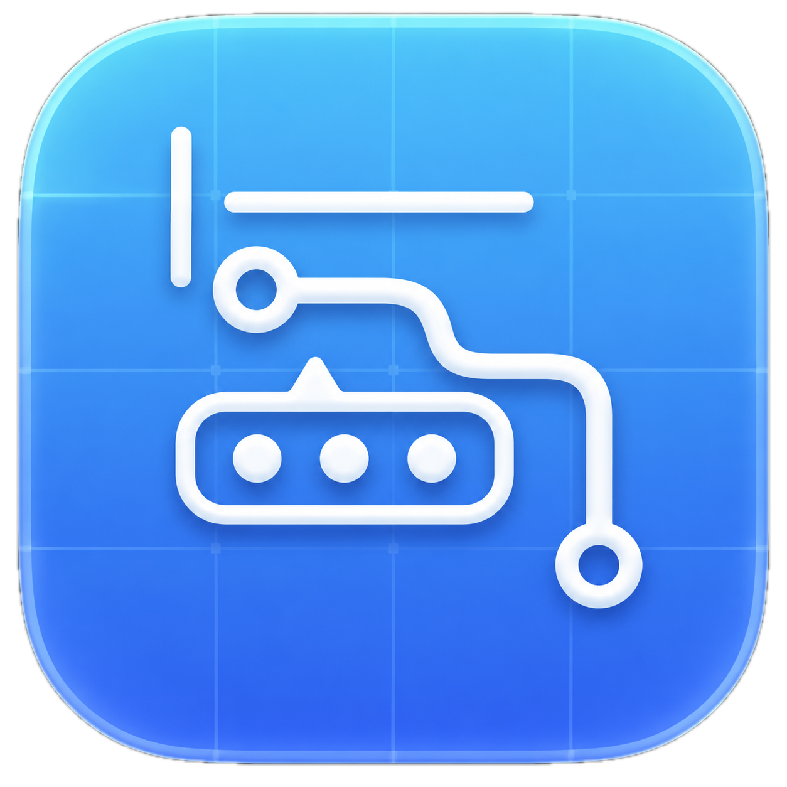

<p align="center">
  
</p>

<h1 align="center">Flemo</h1>

<p align="center">
  A fast, polished inline emoji picker for macOS.
</p>

<p align="center">
  
  
  
</p>

<p align="center">
  <a href="docs/assets/flemo-demo.mp4">Watch the demo video</a>
</p>

<p align="center">
  <video src="docs/assets/flemo-demo.mp4" controls width="720"></video>
</p>

## Overview

Flemo sits quietly in the macOS menu bar and brings emoji search directly to your cursor. Type a trigger, pick from a compact animated suggestion strip, and keep writing without breaking flow.

## Highlights

- Inline emoji suggestions with sleek and descriptive popup layouts.
- Full emoji board with category navigation and keyword search.
- Unified skin tone preference that collapses duplicate people emoji variants.
- Rules for ignored apps and sites.
- Local usage stats and frequency-aware ranking.
- Sparkle-powered update hooks with separate Debug and Release channels.

## Demo

The sample recording is included at [docs/assets/flemo-demo.mp4](docs/assets/flemo-demo.mp4).

## Build

```sh
swift build -c debug --product Flemo
swift build -c release --product Flemo
```

Create a local app bundle:

```sh
BUILD_CONFIGURATION=debug SIGN_IDENTITY=- ./build-app.sh
BUILD_CONFIGURATION=release SIGN_IDENTITY=- ./build-app.sh
```

Use `INSTALL_APP=0` to build without copying into `/Applications`.

## Update Channels

Flemo keeps Debug and Release update tracks separate so Sparkle never crosses streams:

| Channel | App bundle | Bundle ID | Default appcast |
| --- | --- | --- | --- |
| Debug | `Flemo Debug.app` | `com.flemo.debug` | `https://example.com/flemo/debug/appcast.xml` |
| Release | `Flemo.app` | `com.flemo.app` | `https://example.com/flemo/appcast.xml` |

Configure real feeds and public EdDSA keys with:

```sh
FLEMO_DEBUG_APPCAST_URL="https://your-domain.example/flemo/debug/appcast.xml"
FLEMO_RELEASE_APPCAST_URL="https://your-domain.example/flemo/appcast.xml"
FLEMO_DEBUG_SPARKLE_PUBLIC_KEY="..."
FLEMO_RELEASE_SPARKLE_PUBLIC_KEY="..."
```

See [docs/SPARKLE.md](docs/SPARKLE.md) for release notes and signing setup.

## CI

GitHub Actions builds both Debug and Release `.app` bundles and uploads zipped artifacts from every push, pull request, and manual run.

## Requirements

- macOS 14 or newer.
- Swift 5.9 or newer.
- Accessibility and Input Monitoring permissions for global text detection.
